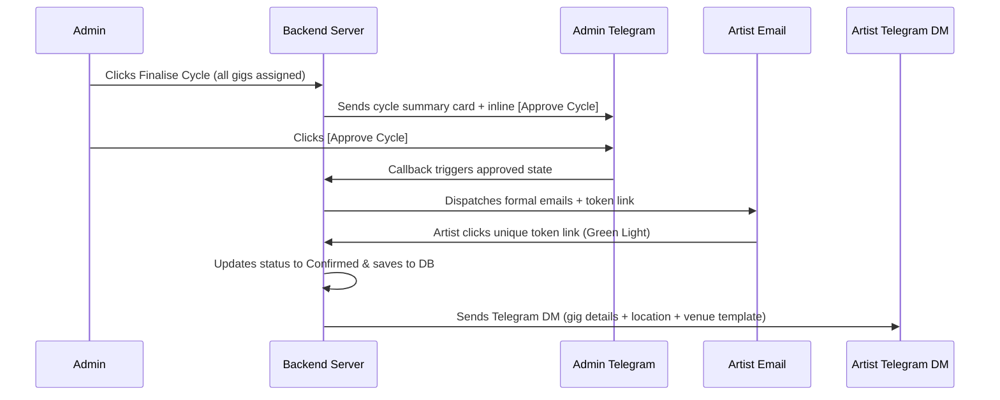

# Marketing Ops Center — Phase-by-Phase Implementation Plan (Updated)

> Build order designed so each phase is independently testable and shippable.
> Never move to the next phase until the current phase passes its verification checklist.

---

## Overview

| Phase | Name | What Gets Built | Est. Effort |
|---|---|---|---|
| 1 | Foundation | Project scaffold, DB, auth, RBAC, Super Admin | 3–4 days |
| 2 | Core Data Layer | Clients, tasks, freelancers (CRUD), Export CSV | 3–4 days |
| 3 | Video Workflow | Task status machine, freelancer assignment, attribution | 3–4 days |
| 4 | Telegram Bot | Bidirectional bot, callbacks, revision flow | 4–5 days |
| 5 | Calendar Sync & Data Migration | Calendar read-only sync; one-time Python sheet migration | 1–2 days |
| 6 | Frontend Workspaces | Role-gated dashboards, Kanban, SSE live updates | 4–5 days |
| 7 | Scheduler & Alerts | Cron jobs, resilient API metric fetch, staleness guards | 3–4 days |
| 8 | Marketing Client Module | API integrations (Insta/YT/Ads), content tracking, review queues | 6–8 days |
| 9 | Client Portal | Unique URL dashboards, mobile content approval, feedback loop | 4–5 days |
| 10 | Artist Curation Module | Roster, status, venue DB + 15-day planning cycle + Email/TG green light | 4–5 days |
| 11 | OpenClaw Integration | Webhook, HMAC, queue, audit | 1–2 days |
| 12 | Hardening & Testing | Full test suite, security audit, manual checklist | 3–4 days |
| 13 | Deployment & Key Rotation | Environment config, reverse proxy, CI/CD, key rotation | 2–3 days |

**Total estimated effort: 40–52 days** (solo developer, full-time)

---

## Phase 1 — Foundation

### Goal
A running Express server with an encrypted SQLite database, JWT authentication, RBAC middleware, and a Super Admin role to eliminate the single-admin bus factor.

### 1.1 Project Scaffold

```
marketing-ops-center/
  .env.example
  package.json
  server.js
  database.js
  scripts/
  src/
    middleware/
    routes/
    services/
    migrations/
  frontend/
```

- Initialise with `npm init`.
- Install core dependencies:

```bash
npm install express helmet express-rate-limit cookie-parser cors dotenv-vault \
  @journeyapps/sqlcipher bcryptjs jsonwebtoken uuid node-cron
```

- Add `nodemon` and `vitest` as dev dependencies.
- Commit `.env.example` with blank values; add `.env` and `.env.vault` to `.gitignore`.

### 1.2 SQLCipher Database

Create `database.js`:
- Open `ops_dashboard.db` with `@journeyapps/sqlcipher`.
- On every connection run `PRAGMA key` before any other query.
- Enable `PRAGMA foreign_keys = ON`.
- Export a single `db` instance used across all routes and services.

Create `src/migrations/001_init.sql` with all table definitions:
- `users` (includes `role` text: `super_admin`, `admin`, `ops_video_editor`, `ops_social_media_manager`)
- `freelancers`
- `sessions`
- `crm_clients` (includes `client_type` TEXT: `'marketing' | 'artist_curation' | 'both'` defaulting to `'marketing'`)
- `kanban_tasks`
- `audit_logs`
- `openclaw_operational_knowledge` (stores autonomous operational insights: key, knowledge_type, content, updated_at)

Write a migration runner in `database.js` that executes pending `.sql` files in order on startup.

### 1.3 Secrets Management
- Configure `dotenv-vault` to load `.env.vault` at startup.
- Required env vars: `DB_ENCRYPTION_KEY`, `JWT_ACCESS_SECRET`, `JWT_REFRESH_SECRET`, `API_CREDENTIALS_KEY`, `ARTIST_BANK_KEY`.
- Server refuses to start if any required var is missing.

### 1.4 Express App Setup (`server.js`)

Apply middleware in this order:
1. `helmet()` with full CSP and HSTS config
2. `cors()` — allow only your frontend origin
3. `cookie-parser()`
4. `express.json()`
5. Global rate limiter (200 req / 15 min per IP)
6. Route mounts (empty stubs for now)
7. 404 and global error handler

### 1.5 Authentication Routes (`src/routes/auth.js`)

Implement `/api/auth/login`, `/api/auth/refresh`, `/api/auth/logout`.

**Login flow:**
1. Look up user by email.
2. `bcrypt.compare` password against `password_hash`.
3. Issue short-lived access JWT (15 min) and long-lived refresh JWT (7 days).
4. Store `sha256(refreshToken)` in `sessions` table.
5. Set both tokens as `HttpOnly Secure SameSite=Strict` cookies.
6. Return `{ role, name }` in the body — no tokens in body.

### 1.6 Auth Middleware (`src/middleware/auth.js`)

```js
authenticate   // verify access JWT from cookie, attach req.user
authorize(roles) // check req.user.role is in the allowed list, return 403 if not. super_admin is implicitly authorized.
```

Apply `authenticate` to every protected route.
Apply `authorize` to admin-only and role-specific routes.

### 1.7 Rate Limiting (`src/middleware/rateLimit.js`)
- Global limiter: already in `server.js`.
- Auth limiter: 10 req / 15 min per IP — applied only to `/api/auth/login` and `/api/auth/refresh`.

### 1.8 Seed Data (`src/migrations/002_seed.sql`)
Insert one `super_admin`, one `admin`, one `ops_video_editor`, one `ops_social_media_manager` with bcrypt-hashed passwords for local dev.

### Phase 1 Verification

- [ ] Server starts without errors; health endpoint returns `{ status: 'ok', db: 'encrypted' }`.
- [ ] `POST /api/auth/login` with correct credentials sets HttpOnly cookies and returns role.
- [ ] `super_admin` can access all routes; `admin` is restricted to non-super-admin routes.
- [ ] Auth rate limiter returns `429` after 10 attempts.
- [ ] `POST /api/auth/refresh` issues new tokens and rejects the old refresh token on a second use.
- [ ] Database file is binary-encrypted.

---

## Phase 2 — Core Data Layer

### Goal
Full CRUD for clients, tasks, and freelancers behind correct RBAC, plus CSV export to replace any residual need for Google Sheets.

### 2.1 Client Routes (`src/routes/clients.js`)

| Endpoint | Auth | Notes |
|---|---|---|
| `GET /api/clients` | admin, super_admin | Return all clients |
| `POST /api/clients` | admin, super_admin | Accept `client_type` ('marketing' \| 'artist_curation' \| 'both'), `calendar_sync_link`, `drive_folder_link`, API fields |
| `PATCH /api/clients/:id` | admin, super_admin | Same fields allowed as POST |

### 2.2 Freelancer & Task Routes
(Standard CRUD, scoped by RBAC).

### 2.3 Audit Log Helper

Create `src/services/auditLogger.js`:
```js
logAction({ actorId, action, entityType, entityId, diff, ip })
```

### 2.4 CSV Export Service (Solves Dual System Risk)

Add `src/services/csvExport.js` and endpoints to replace ad-hoc Google Sheets usage:

| Endpoint | Auth | Notes |
|---|---|---|
| `GET /api/clients/:id/export/content` | admin, super_admin | Generates CSV of `marketing_content_tracker` |
| `GET /api/clients/:id/export/ads` | admin, super_admin | Generates CSV of `marketing_ad_campaigns` |
| `GET /api/clients/:id/export/monthly` | admin, super_admin | Generates CSV of `marketing_monthly_report` |

### Phase 2 Verification

- [ ] Client/Freelancer/Task CRUD works with proper RBAC.
- [ ] CSV Export endpoints return downloadable, properly formatted CSV files.
- [ ] Every mutation appears in `audit_logs`.

---

## Phase 3 — Video Workflow

### Goal
The full status machine for video tasks, freelancer assignment, and the attribution report.

*(Remains identical to Phase 3: Status machine, Freelancer assignment, Approval, Revision, Attribution.)*

---

## Phase 4 — Telegram Bot

### Goal
Full bidirectional Telegram integration: outgoing notifications, inline keyboards, callbacks, and revision flow.

*(Remains identical to Phase 4.)*

---

## Phase 5 — Calendar Sync & Data Migration

### Goal
Read-only Google Calendar sync and a robust, one-time migration path for historical Google Sheets data. **No bidirectional sheet sync. No write-back.** The application database is the sole source of truth.

### 5.1 Google API Credentials (Calendar Only)
Service account with `calendar.readonly` scope only.

### 5.2 Calendar Sync Service
`syncClientCalendar(client)` - fetches events to `calendar_events` table.

### 5.3 Standalone Python Migration Script (Built for Resilience)

Path: `scripts/migrate_sheets.py`. Run manually by admin once per client.

**Resilience Features:**
1. **Version Locking**: The script reads a `TARGET_MIGRATION_VERSION` constant. It checks a `migration_metadata` table in SQLite. If the DB schema version is newer than the script supports, it aborts with a clear error message.
2. **Schema Validation**: Before inserting data, the script introspects the SQLite table schemas and verifies expected columns exist. If columns are missing, it aborts.
3. **Dry Run Mode**: `python migrate_sheets.py --dry-run` reads sheets and validates data but does not write to SQLite, printing a summary of rows to be migrated.
4. **Transaction Batching**: Inserts data in batches of 50 rows per transaction. If a row fails, only that batch rolls back, and the error is logged with the Sheet row number.
5. Marks migrated rows with `source = 'migration'`. API data is `source = 'api_discovered'`. They coexist; API data never overwrites migrated historical data.

### Phase 5 Verification

- [ ] Calendar sync works.
- [ ] Python script dry-run completes successfully.
- [ ] Python script aborts if DB schema version mismatches.
- [ ] No Google Sheets read/write in the Node.js application.

---

## Phase 6 — Frontend Workspaces

### Goal
Role-gated SPA with Kanban, SSE, and Google Drive previews.

*(Remains identical to Phase 6, removing any reference to Sheets sync buttons, keeping Calendar sync).*

---

## Phase 7 — Scheduler & Alerts (Resilient Cron)

### Goal
Automated daily calendar sync, D-5 alerts, and **fault-tolerant** API metric fetching that handles rate limits, partial failures, and stale data gracefully.

### 7.1 Scheduler Setup (`src/services/scheduler.js`)

```js
// Daily calendar sync
cron.schedule('0 0 * * *', runDailyCalendarSync);

// D-5 check
cron.schedule('0 8 * * *', runD5Check);

// API metric fetch — every 6 hours
cron.schedule('0 */6 * * *', runAPIMetricFetch);
```

### 7.2 API Metric Fetch Job (Solves Partial Failure, Rate Limits, & Silent Token Expiry)

```js
async function runAPIMetricFetch() {
  const clients = await getActiveClientsWithAPIs();
  
  for (const client of clients) {
    try {
      const recentContent = await getRecentContent(client.id, 30);
      
      await fetchInstagramMetrics(client, recentContent);
      await fetchYouTubeMetrics(client, recentContent);
      
      await updateClient(client.id, { 
        consecutive_api_failures: 0, 
        api_status: 'active',
        last_metric_fetch_at: new Date().toISOString()
      });
      
    } catch (error) {
      const failures = client.consecutive_api_failures + 1;
      const status = failures >= 3 ? 'error' : client.api_status;
      
      await updateClient(client.id, { consecutive_api_failures: failures, api_status: status });
      
      if (failures === 3) {
        await notifyAdmin(`⚠️ API fetch failing for ${client.name}. Status set to ERROR. Check tokens.`);
      }
    }
  }
}
```

**Metric Override Logic (Solves Field Collision):**
During the fetch, the cron checks a `metric_override` JSON column on the content tracker row.
```js
if (!content.metric_override?.views) {
  content.views = apiData.views;
}
```

### 7.3 UI Staleness Guard
In the Admin Dashboard, if `last_metric_fetch_at` is > 24 hours old or `api_status !== 'active'`, display a warning banner: *"Metrics may be stale. Check API connection."*

### Phase 7 Verification

- [ ] Cron job processes clients independently; Client B succeeds even if Client A fails.
- [ ] `consecutive_api_failures` reaches 3 triggers a Telegram alert to Admin.
- [ ] `metric_override = { "views": true }` prevents cron from overwriting manual views.
- [ ] Staleness warning appears in UI if `last_metric_fetch_at` > 24 hours.

---

## Phase 8 — Marketing Client Module (API-Driven & Approval-Ready)

### Goal
Track marketing data via APIs. Ops Managers plan content and submit it for client approval. Clients approve via the portal (Phase 9). Includes a review queue for auto-discovered media and manual fallbacks. **No Google Sheets read or write.**

### 8.1 Database Schema Additions (`003_marketing_client_module.sql`)

#### API Credential Columns on `crm_clients`
Add: `consecutive_api_failures INTEGER DEFAULT 0`.

#### `marketing_content_tracker`
| Column | Type | Notes |
|---|---|---|
| `id` | `INTEGER PK` | |
| `client_id` | `INTEGER FK` | |
| `platform` | `TEXT` | `'instagram'` \| `'youtube'` |
| `media_id` | `TEXT` | Platform-specific ID for cron fetching |
| `date` | `TEXT` | `YYYY-MM-DD` |
| `post_type` | `TEXT` | `'Story'` \| `'Static'` \| `'Carousel'` \| `'Reel'` \| `'Youtube'` \| `'Short'` |
| `title` | `TEXT` | |
| `script` | `TEXT` | Used for client approval workflow |
| `status` | `TEXT` | `'Draft'` \| `'Pending Client Approval'` \| `'Client Approved'` \| `'Client Rejected'` \| `'Posted'` \| `'Pending'` |
| `client_comments` | `TEXT` | Feedback from client during approval |
| `client_approved` | `INTEGER` | `0` or `1` |
| `is_tracked` | `INTEGER DEFAULT 1` | `0` = Unreviewed API discovery; `1` = Tracked in reports/portal |
| `metric_override` | `TEXT` | JSON object mapping fields to booleans |
| `source` | `TEXT` | `'manual'` \| `'api_discovered'` \| `'migration'` |
| `views` | `INTEGER` | |
| `likes` | `INTEGER` | |
| `comments` | `INTEGER` | |
| `shares` | `INTEGER` | |
| `saves` | `INTEGER` | |
| `avg_watch_time_pct` | `REAL` | |
| `skip_rate_pct` | `REAL` | **Auto-computed** |
| `boosted` | `TEXT` | `'No'` or `'Yes - ₹{spend}'` |
| `engagement_rate_pct` | `REAL` | **Auto-computed** |
| `save_rate_pct` | `REAL` | **Auto-computed** |
| `content_score` | `REAL` | **Auto-computed** |

#### `marketing_monthly_report`
| Column | Type | Notes |
|---|---|---|
| `id` | `INTEGER PK` | |
| `client_id` | `INTEGER FK` | |
| `month` | `TEXT NOT NULL` | `'YYYY-MM'` |
| `website_traffic` | `INTEGER` | |
| `map_views` | `INTEGER` | |
| `mom_growth_sessions` | `REAL` | **Auto-computed** |
| `mom_growth_gmb_views` | `REAL` | **Auto-computed** |
| `ai_overview_visible` | `TEXT` | `'Yes'` / `'No'` |

#### `marketing_ad_campaigns`
| Column | Type | Notes |
|---|---|---|
| `id` | `INTEGER PK` | |
| `client_id` | `INTEGER FK` | |
| `platform` | `TEXT` | `'YouTube'` \| `'Meta'` \| `'Google'` |
| `ad_campaign_name` | `TEXT` | |
| `leads` | `INTEGER` | |
| `total_ad_spend_inr` | `REAL` | |
| `impressions` | `INTEGER` | |
| `clicks` | `INTEGER` | |
| `ctr_pct` | `REAL` | **Auto-computed** |
| `cpc_inr` | `REAL` | **Auto-computed** |
| `cpl_inr` | `REAL` | **Auto-computed** |
| `revenue_generated` | `REAL` | |
| `roas` | `REAL` | **Auto-computed** |

### 8.2 Auto-Computed Columns (Backend Formula Implementations)

The backend calculates these columns natively matching your spreadsheet formulas:

**Content Tracker Calculations:**
```
engagement_rate_pct = ((likes + comments + shares + saves) / views) * 100
save_rate_pct       = (saves / views) * 100
skip_rate_pct       = 100 - avg_watch_time_pct
content_score       = ROUND((engagement_rate_pct * 0.3) + (save_rate_pct * 2.5) + (avg_watch_time_pct * 0.45), 1)
```

**Monthly Report Calculations:**
```
mom_growth_sessions  = (website_traffic_current - website_traffic_prev) / website_traffic_prev
mom_growth_gmb_views = (map_views_current - map_views_prev) / map_views_prev
```

**Ad Campaigns Calculations:**
```
ctr_pct           = ROUND(clicks / impressions * 100, 2)
cpc_inr           = ROUND(total_ad_spend_inr / clicks, 0)
cpl_inr           = ROUND(total_ad_spend_inr / leads, 0)
roas              = revenue_generated / total_ad_spend_inr
```
*Guard: Set to `null` if any denominator is 0.*

### 8.3 API Integration Services (Rate-Limit Aware)
- **Instagram Graph API & YouTube Data API**: Automatically discover media, entering them into the database with `is_tracked = 0`. Ops Manager reviews them on the dashboard to track or discard.
- **Google Ads Manual Entry Fallback**: Configure campaign creative, spends, and lead metrics manually.

### 8.4 Ops Manager Content Planning Endpoints

| Method | Endpoint | Description | Auth |
|---|---|---|---|
| `POST` | `/api/clients/:id/marketing/content` | Create draft content plan (script, date, type) | admin, ops_social_media_manager |
| `PATCH` | `/api/clients/:id/marketing/content/:contentId` | Update draft fields | admin, ops_social_media_manager |
| `POST` | `/api/clients/:id/marketing/content/:contentId/submit-approval` | Changes status to `'Pending Client Approval'` | admin, ops_social_media_manager |
| `POST` | `/api/clients/:id/marketing/content/review/:contentId` | Accepts (`is_tracked = 1`) or rejects auto-discovered media | admin, ops_social_media_manager |

### Phase 8 Verification

- [ ] Auto-discovered media enters with `is_tracked = 0` and is hidden from reports/portal.
- [ ] Ops Manager can "Track" an item, making it visible.
- [ ] Ops Manager can create a content plan and change status to `'Pending Client Approval'`.
- [ ] Setting `metric_override` for a field prevents cron from overwriting it.

---

## Phase 9 — Client Portal (Mobile-Optimized & Content Approval)

### Goal
Each marketing client receives a **unique, secure, phone-optimized URL** to view performance dashboards AND approve upcoming content plans. It features a feedback loop and optional security layers.

### 9.1 Database Schema Additions (`005_client_portal.sql`)

```sql
ALTER TABLE crm_clients ADD COLUMN portal_token TEXT UNIQUE;
ALTER TABLE crm_clients ADD COLUMN portal_enabled INTEGER DEFAULT 0;
ALTER TABLE crm_clients ADD COLUMN portal_pin TEXT; -- bcrypt hashed PIN
ALTER TABLE crm_clients ADD COLUMN portal_last_accessed_at TEXT;
```

Add a `client_requests` table to track portal feedback.

### 9.2 Portal Authentication Model
1. Admin shares URL: `https://yourdomain.com/portal/{token}`.
2. PIN Check (If enabled): Prompt for PIN on session start. Verified via bcrypt.
3. Middleware validates token + PIN (if applicable). Attaches `req.portalClient`.
4. Enforces rate limits (100 req / 15 min per token).
5. Returns `404` for invalid tokens.

### 9.3 Portal Routes (`src/routes/portal.js`)

| Method | Endpoint | Description |
|---|---|---|
| `GET` | `/api/portal/:token/overview` | High-level KPIs |
| `GET` | `/api/portal/:token/content` | Past performance content |
| `GET` | `/api/portal/:token/ads` | Ad campaign rows |
| `GET` | `/api/portal/:token/content-plan` | Upcoming content where `status = 'Pending Client Approval'` |
| `POST` | `/api/portal/:token/content-plan/:contentId/approve` | Sets `client_approved = 1`, `status = 'Client Approved'` |
| `POST` | `/api/portal/:token/content-plan/:contentId/reject` | Sets `client_approved = 0`, `status = 'Client Rejected'`. Requires comment. |
| `POST` | `/api/portal/:token/feedback` | General feedback/requests. Alerts Ops Manager via Telegram. |

### 9.4 Portal Frontend (`frontend/src/views/ClientPortal.jsx`)
A separate, lightweight, **mobile-first** build/route accessible at `/portal/:token`.
- **Content Plan Tab**: Script/Caption details (expandable) with large action buttons: **[✓ Approve]** and **[✗ Request Changes]**.
- **Overview Tab**: Engagement rate, Content score, Total Leads, ROAS metrics.

### 9.5 Ops Manager Notification Loop
1. **Approve:** status updates to `'Client Approved'` on dashboard Kanban.
2. **Reject/Comment:** Sends a Telegram alert to the Ops Manager: *"Client [Name] requested changes on [Title]: [Comment]"*.

### Phase 9 Verification

- [ ] Portal URL works on mobile devices; UI is clean.
- [ ] Client clicking "Approve" updates the DB status to `'Client Approved'`.
- [ ] Client clicking "Request Changes" prompts for a comment, updates status to `'Client Rejected'`, and triggers a Telegram alert to Ops.

---

## Phase 10 — Artist Curation Module (Planning Cycles & Email/TG Confirmation Workflow)

### Goal
Manage artist rosters, gig scheduling, and venues entirely in the local database. Admin-approved curation planning triggers emails to artists, and their confirmation is the green light that dispatches automated Telegram DMs. **No Google Sheets read or write.**

### 10.1 Database Schema — Artist Curation (`004_artist_curation.sql`)

#### `artists` (Roster)
- Includes `artist_id` (`UPPER(LEFT(name, 3)) + RIGHT(phone, 4)` format, e.g. `ALP4490`).
- `bank_details` is encrypted using AES-256-GCM via `ARTIST_BANK_KEY` and decrypts only for Super Admins.
- Roster rollups: `total_performances`, `average_fee_inr`, `total_amount_paid_inr`, `payment_status`, `reliability_score`.

#### `gig_status`
- Tracks client, venue, date, payment, and status (`'Paid' | 'Pending' | 'Advance Paid' | 'Cancelled' | 'Hold'`).
- Columns `confirmation_token` (TEXT) and `token_expires_at` (TEXT) manage email confirmations.

#### `venues`
- Stores locations, POC details, map links, and customizable templates for `gig_confirmed_message`.

#### `artist_planning_cycles`
- Tracks 15-day rolling cycles (`Cycle 1`: days 1–15; `Cycle 2`: days 16–end).
- Status: `'upcoming'` | `'open'` | `'admin_approved'` | `'finalised'` | `'completed'`.

### 10.2 Roster Rollups Calculations
Roster KPIs are computed locally matching your sheet formulas:
- `reliability_score = ROUND(paid_gigs / total_assigned_gigs * 100, 0)` (or `'N/A'`).
- `payment_status = IFERROR(IF(total_gigs=0, "No Records", IF(pending_gigs>0, "⚠ Pending", "✅ All Paid")), "No Records")`.
- `average_fee_inr` and `total_amount_paid_inr` automatically recalculate on gig completions.

### 10.3 The Multi-Stage Telegram & Email Curation Workflow



1. **Submit**: When the planning cycle is ready, the admin clicks "Finalise". The system sends an approval request message to the Admin's Telegram bot.
2. **Admin Telegram Approval**: Admin clicks `[Approve Cycle]`. The callback transitions the cycle status to `'admin_approved'`.
3. **Artist Email Trigger**: The backend generates secure confirmation tokens and emails the artists their gig dates, map links, and a confirmation button (`GET /api/public/gigs/confirm/:token`).
4. **Artist Confirmation (The Green Light)**:
   - Artist clicks the email confirmation button.
   - Gig status is updated to `'Confirmed'` in the DB.
   - The backend automatically sends the Telegram DM containing confirmed dates, directions, and the specific venue's `gig_confirmed_message`.

### 10.4 API Endpoints

| Method | Endpoint | Description | Auth |
|---|---|---|---|
| `GET` | `/api/artists` | List roster (filterable by category, city, active) | admin |
| `POST` | `/api/artists` | Add artist to roster | admin |
| `PATCH` | `/api/artists/:id` | Update artist details | admin |
| `GET` | `/api/artists/:id/bank` | Retrieve decrypted bank details | super_admin |
| `GET` | `/api/venues` | List venues | admin |
| `POST` | `/api/planning-cycles/:id/submit-approval` | Submit cycle for approval, sending Telegram card to Admin | admin |
| `GET` | `/api/public/gigs/confirm/:token` | Artist confirms gig via email token (green light), updates status, and dispatches Telegram DM | None (Public) |
| `PATCH` | `/api/gigs/:id` | Update gig status, payment, advance | admin |

### Phase 10 Verification
- [ ] Admin clicks Finalise → summary card is delivered to Admin Telegram.
- [ ] Admin approves on Telegram → confirmation email is sent to artist; no Telegram DM is sent yet.
- [ ] Artist clicks the email confirmation link → status updates to `'Confirmed'`, and the artist's Telegram bot dispatches the confirmed dates and venue message.
- [ ] Bank details encrypt on write, and only decrypt via secure super_admin credentials.

---

## Phase 11 — OpenClaw Integration

### Goal
Secure OpenClaw webhook with replay-attack prevention, an async task queue, audit log processing, and an operational knowledge store. **No Google Sheets integration.**

### 11.1 Webhook Route (`src/routes/openclaw.js`)
`POST /api/openclaw/webhook`
- HMAC-SHA256 signature verification.
- Replay attack checks via timestamp and nonce caching.

### 11.2 Task Queue
- Processes task events: `'create_task'`, `'update_task'`, `'optimize_queue'` in local SQLite tables.
- Emits live updates to frontend workspaces via SSE.

### 11.3 Operational Knowledge Service (`src/services/openClawKnowledge.js`)
Provide database wrapper functions to read/write self-improving logs:
- `getKnowledge(key)`: Returns parsed JSON of the `content` column.
- `updateKnowledge(key, type, contentJson)`: Upserts key, knowledge_type, and stringified JSON content, and updates the timestamp. Allows OpenClaw to store client preferences, editor speeds, and metric thresholds dynamically.

---

## Phase 12 — Hardening & Testing

### Goal
Full test coverage, security audit, and manual verification.

### 12.1 Test Suite
- JWT security and cookie settings verification.
- **Client Portal Security**: Enforce token and PIN authentication, prevent cross-client data leakage.
- **Webhook HMAC validation**: Reject unauthorized webhook payloads.
- Enforce that there are **no Google Sheets write-backs or credentials** active in the code.

### 12.2 Security Configurations
- Helmets CSP headers configured.
- AES-256-GCM encryption on client keys and bank details.
- Standard brute-force rate limiters on Webhook, Auth, and Portal endpoints.

---

## Phase 13 — Deployment & Key Rotation

### Goal
Production deployment, database backup schedules, and safe key rotation.

### 13.1 Key Rotation Utility
`scripts/rotate-encryption-key.js`:
- Safe, transaction-wrapped script that re-encrypts database credentials and bank details with a new key and updates `.env.vault`.

### 13.2 CI/CD, Process, and Backup Configurations
- GitHub Actions pipeline to run tests and push code.
- Caddy setup for automatic SSL.
- PM2 configuration: `pm2 start server.js --name hyphening-ops`.
- Encrypted SQLite backups copy off-site daily.

### Phase 13 Verification
- [ ] Staging pipeline builds successfully.
- [ ] `rotate-encryption-key.js` runs staging database rotations with zero data loss.
- [ ] Off-site daily backup is verified restorable.


# Blog Section — OpenClaw Integrated, SEO-Optimized

Add a full blog system to the Hyphening website, integrated into the **OpenClaw webhook system** so the AI agent can automatically create, update, and optimize blog posts. The public pages will be fully SEO-optimized with structured data, sitemap, internal linking, and meta tags.

## Proposed Changes

### Database — Blog Posts Table

#### [NEW] [030_blog_posts.sql](file:///Users/jomygeorge/Desktop/hyphening/src/migrations/030_blog_posts.sql)
- New `blog_posts` table:
  - `id`, `title`, `slug` (unique, URL-friendly)
  - `excerpt` — Short summary for cards and meta descriptions
  - `content` — Full article body in Markdown
  - `cover_image_url` — Hero image URL
  - `author` — Author name
  - `category` — e.g. "Social Media", "Branding", "Growth", "Tech"
  - `tags` — Comma-separated tags for filtering
  - `meta_title` — Custom SEO title (falls back to title)
  - `meta_description` — Custom meta description (falls back to excerpt)
  - `meta_keywords` — SEO keywords
  - `internal_links` — JSON array of internal link slugs for cross-linking
  - `status` — `draft` / `published`
  - `published_at`, `created_at`, `updated_at`
- Indexes on `slug`, `status`, `published_at`, and `category`.

---

### OpenClaw Integration — Blog Event Handlers

#### [MODIFY] [openclaw.js](file:///Users/jomygeorge/Desktop/hyphening/src/routes/openclaw.js)

Add two new event types to the OpenClaw webhook system:

**`create_blog_post`** — OpenClaw sends a full blog post payload:
```json
{
  "event_type": "create_blog_post",
  "payload": {
    "title": "10 Proven Instagram Reel Strategies for D2C Brands in 2026",
    "excerpt": "Discover data-backed reel strategies...",
    "content": "# Introduction\n\nInstagram Reels...(full markdown)...",
    "cover_image_url": "https://images.unsplash.com/...",
    "author": "Hyphening Media",
    "category": "Social Media",
    "tags": "instagram,reels,d2c,growth",
    "meta_title": "10 Instagram Reel Strategies for D2C Brands | Hyphening Media",
    "meta_description": "Learn 10 proven Instagram Reel strategies...",
    "meta_keywords": "instagram reels, d2c brands, social media marketing",
    "internal_links": ["social-media-marketing-guide", "content-strategy-101"],
    "status": "published"
  }
}
```
- Auto-generates slug from title (e.g. `10-proven-instagram-reel-strategies-for-d2c-brands-in-2026`)
- Sets `published_at` to current timestamp if status is `published`
- Staged for Telegram confirmation like all other OpenClaw events

**`update_blog_post`** — Update an existing post by `blog_id` or `slug`:
```json
{
  "event_type": "update_blog_post",
  "payload": {
    "blog_id": 5,
    "content": "...updated markdown...",
    "internal_links": ["new-related-post-slug"],
    "meta_title": "Updated SEO Title"
  }
}
```

Changes to [openclaw.js](file:///Users/jomygeorge/Desktop/hyphening/src/routes/openclaw.js):
- Add `'create_blog_post'` and `'update_blog_post'` to the `knownEvents` array
- Add `case 'create_blog_post': return handleCreateBlogPost(payload);` and `case 'update_blog_post': return handleUpdateBlogPost(payload);` to the `executeEvent` switch
- Implement `handleCreateBlogPost()` and `handleUpdateBlogPost()` handler functions

---

